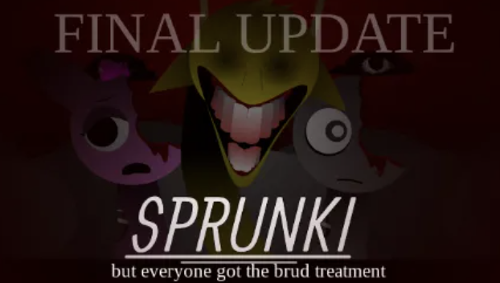

# Sprunki Brud Edition

A horror-themed music creation game where Simon has devoured everything in sight! Experience a unique twist on the Sprunki series where every interface element bears Simon's bite marks.

🎮 [Play Now](https://sprunkiretake.io/games/sprunki-brud-edition)

## 📺 Game Preview

Watch the gameplay videos to get a taste of the horror:

- [Sprunki Brud Edition: BITE!!!!!!](https://www.youtube.com/watch?v=KQLI1VLZwto)
- [Simon's Snack Remake - Finale Update](https://www.youtube.com/watch?v=-p63hedm_Ro)

## 🎵 Features

### Core Gameplay
- **Horror-Themed Interface**: Every element has been bitten by Simon, creating a uniquely disturbing atmosphere
- **Bite-Marked Controls**: Navigate through partially devoured progress bars and nibbled icons
- **Jump Scares**: Experience Simon's sudden appearances as he continues his feast
- **Eerie Sound Effects**: Create music with a haunting twist

### Game Modes
- **Horror Mode**: Experience Simon's reign of terror
- **Nightmare Creation**: Compose in the twisted environment
- **Dark Collaboration**: Share the horror with others
- **Survival Mode**: Escape Simon's endless hunger

## 🎹 Music Creation

Create spine-chilling compositions using:
- Horror-themed sound library
- Eerie effects and ambiance
- Haunting melodies
- Disturbing percussion elements

## 🎨 Visual Style

The game features a unique "brud treatment" where:
- Interface elements show bite marks
- Progress bars are partially eaten
- Icons are nibbled
- Menus bear Simon's teeth marks

## 🔄 Regular Updates

The game receives continuous updates including:
- New horror sounds
- Additional features
- Community events
- Seasonal content

## 📱 Cross-Platform Support

Play seamlessly across:
- Desktop browsers
- Mobile devices
- Tablets
- All modern web browsers

## 🎮 How to Play

1. Visit the [game page](https://sprunkiretake.io//games/sprunki-brud-edition)
2. Navigate through the bitten interface
3. Create music using the horror-themed tools
4. Survive Simon's appetite while making your compositions

